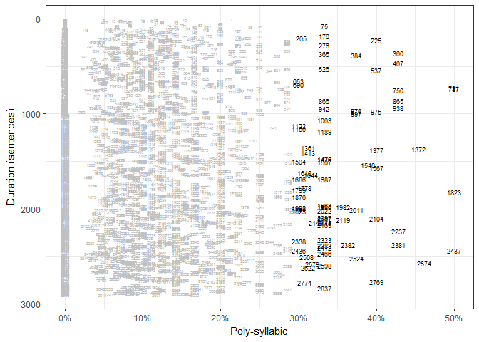
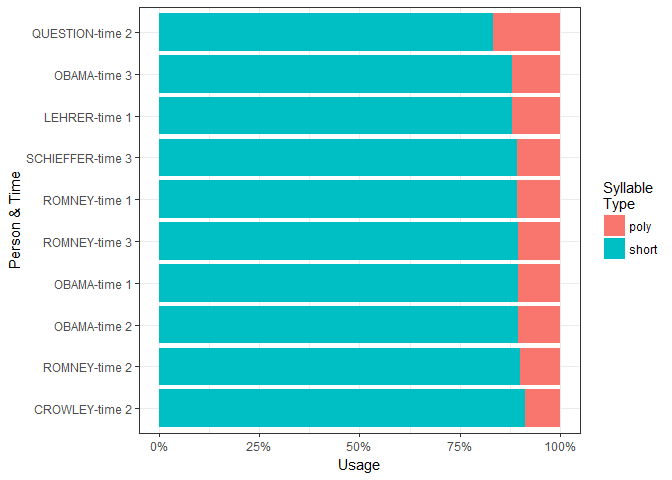

syllable   
============

**syllable** is a small collection of tools for counting syllables and
polysyllables. The tools rely primarily on
[**data.table**](https://cran.r-project.org/web/packages/data.table/index.html)
hash table lookups, resulting in fast syllable counting.

Table of Contents
============

-   [Main Functions](#main-functions)
    -   [Actions](#actions)
    -   [Objects](#objects)
    -   [Putting It Together](#putting-it-together)
-   [Installation](#installation)
-   [Contact](#contact)
-   [Examples](#examples)
    -   [Count Syllables In a String](#count-syllables-in-a-string)
    -   [Count Syllables In a Vector of Strings](#count-syllables-in-a-vector-of-strings)
    -   [Sum the Syllables In a Vector of Strings by Grouping Variable(s)](#sum-the-syllables-in-a-vector-of-strings-by-grouping-variables)
    -   [Tally the Short/Poly-Syllabic Words by Group(s)](#tally-the-shortpoly-syllabic-words-by-groups)
    -   [Readability Word Statistics by Grouping Variable(s)](#readability-word-statistics-by-grouping-variables)
    -   [Visualize Poly Syllable Distributions](#visualize-poly-syllable-distributions)
    -   [Visualize Poly Syllable Distributions by Group](#visualize-poly-syllable-distributions-by-group)

Main Functions
============

The main functions follow the format of `action_object`.

Actions
-------

The following table outlines the actions. Example Output correspond to
this string: `"I like chicken sandwiches."`.

<table style="width:136%;">
<colgroup>
<col width="20%" />
<col width="40%" />
<col width="33%" />
<col width="41%" />
</colgroup>
<thead>
<tr class="header">
<th align="left">Action</th>
<th align="left">Description</th>
<th align="left">Returns</th>
<th align="left">Example Output</th>
</tr>
</thead>
<tbody>
<tr class="odd">
<td align="left"><code>count</code></td>
<td align="left">One integer per word</td>
<td align="left">A vector per string</td>
<td align="left">1, 1, 2, 3</td>
</tr>
<tr class="even">
<td align="left"><code>sum</code></td>
<td align="left">Sum of syllable counts</td>
<td align="left">An integer per string</td>
<td align="left">7</td>
</tr>
<tr class="odd">
<td align="left"><code>tally</code>*</td>
<td align="left">Sum of syllable attributes</td>
<td align="left">An integer per string</td>
<td align="left">pollysyllable tallies = 1</td>
</tr>
</tbody>
</table>

\* The addition of `_mono`, `_di`, `_poly` `_short` (monosyllabic +
disyllabic), or `_both` (short & pollysyllabic) to `tally` allows the
user specify what syllable attribute is being tallied.

Objects
-------

The following table outlines the objects acted upon:

<table>
<thead>
<tr class="header">
<th align="left">Object</th>
<th align="left">Description</th>
<th align="left">Example</th>
</tr>
</thead>
<tbody>
<tr class="odd">
<td align="left"><code>string</code></td>
<td align="left">A character string</td>
<td align="left"><code>&quot;I like chicken sandwiches.&quot;</code></td>
</tr>
<tr class="even">
<td align="left"><code>vector</code>*</td>
<td align="left">A vector of character strings</td>
<td align="left"><code>c(&quot;I like it.&quot;, &quot;Look out!&quot;)</code></td>
</tr>
</tbody>
</table>

\* The addition of `_by` to `vector` allows the user to aggregate by one
or more vectors of grouping variables.

Putting It Together
-------------------

The function `count_vector` will provide a vector of integer counts for
each word in a string. For this reason `count_vector` will return a
`list` of integer vector counts.

    count_vector(c("I like it.", "Look out!"))

    ## $`1`
    ## [1] 1 1 1
    ## 
    ## $`2`
    ## [1] 1 1

Each of the main functions is optimized to do its task efficiently.
While one could use `sum(count_vector(x))` and achieve the same results
as `sum_vector(x)` it would be less efficient.

The available syllable functions that follow the format of
`action_object` are:

<!-- html table generated in R 3.2.4 by xtable 1.8-2 package -->
<!-- Sun Apr 03 10:39:27 2016 -->
<table>
<tr>
<td>
count_string
</td>
<td>
tally_both_string
</td>
<td>
tally_mono_string
</td>
<td>
tally_short_string
</td>
</tr>
<tr>
<td>
count_vector
</td>
<td>
tally_both_vector
</td>
<td>
tally_mono_vector
</td>
<td>
tally_short_vector
</td>
</tr>
<tr>
<td>
count_vector_by
</td>
<td>
tally_both_vector_by
</td>
<td>
tally_mono_vector_by
</td>
<td>
tally_short_vector_by
</td>
</tr>
<tr>
<td>
sum_string
</td>
<td>
tally_di_string
</td>
<td>
tally_poly_string
</td>
<td>
</td>
</tr>
<tr>
<td>
sum_vector
</td>
<td>
tally_di_vector
</td>
<td>
tally_poly_vector
</td>
<td>
</td>
</tr>
<tr>
<td>
sum_vector_by
</td>
<td>
tally_di_vector_by
</td>
<td>
tally_poly_vector_by
</td>
<td>
</td>
</tr>
</table>

<b><em>Available Variable Functions</em></b>

Installation
============

To download the development version of **syllable**:

Download the [zip
ball](https://github.com/trinker/syllable/zipball/master) or [tar
ball](https://github.com/trinker/syllable/tarball/master), decompress
and run `R CMD INSTALL` on it, or use the **pacman** package to install
the development version:

    if (!require("pacman")) install.packages("pacman")
    pacman::p_load_gh("trinker/syllable")

Contact
=======

You are welcome to:    
- submit suggestions and bug-reports at: <https://github.com/trinker/syllable/issues>    
- send a pull request on: <https://github.com/trinker/syllable/>    
- compose a friendly e-mail to: <tyler.rinker@gmail.com>    

Examples
========

The following examples demonstrate the functionality of a select sample
of **syllable** functions.

Count Syllables In a String
---------------------------

Counts the number of syllables for each word in a string.

    count_string("I like chicken and eggs for breakfast")

    ## [1] 1 1 2 1 1 1 2

Count Syllables In a Vector of Strings
--------------------------------------

    sents <- c("I like chicken.", "I want eggs benidict for breakfast.")
    count_vector(sents)

    ## $`1`
    ## [1] 1 1 2
    ## 
    ## $`2`
    ## [1] 1 1 1 3 1 2

    Map(function(x, y) setNames(x, y),
       count_vector(sents),
       strsplit(gsub("[^a-z ]", "", tolower(sents)), "\\s+")
    )

    ## $`1`
    ##       i    like chicken 
    ##       1       1       2 
    ## 
    ## $`2`
    ##         i      want      eggs  benidict       for breakfast 
    ##         1         1         1         3         1         2

Sum the Syllables In a Vector of Strings by Grouping Variable(s)
----------------------------------------------------------------

    dat <- data.frame(
       text = c("I like chicken.", "I want eggs benedict for breakfast.", "Really?"),
       group = c("A", "B", "A")
    )
    sum_vector_by(dat$text, dat$group)

    ##    group n.words count
    ## 1:     A       4     7
    ## 2:     B       6     9

Tally the Short/Poly-Syllabic Words by Group(s)
-----------------------------------------------

    dat <- data.frame(
       text = c("I like excellent chicken.", "I want eggs benedict now.", "Really?"),
       group = c("A", "B", "A")
    )
    tally_both_vector_by(dat$text, dat$group)

    ##    group n.words short poly
    ## 1:     A       5     3    2
    ## 2:     B       5     4    1

    with(presidential_debates_2012, tally_both_vector_by(dialogue, person))

    ##       person n.words short poly
    ## 1:     OBAMA   18319 16286 2033
    ## 2:    ROMNEY   19924 17858 2066
    ## 3:   CROWLEY    1672  1525  147
    ## 4:    LEHRER     765   674   91
    ## 5:  QUESTION     583   486   97
    ## 6: SCHIEFFER    1445  1289  156

Readability Word Statistics by Grouping Variable(s)
---------------------------------------------------

    with(presidential_debates_2012, readability_word_stats_by(dialogue, list(person, time)))

    ##        person   time n.sents n.words n.chars n.sylls n.shorts n.polys
    ##  1:     OBAMA time 1     174    3599   16002    5221     3221     378
    ##  2:     OBAMA time 2     471    7477   32459   10654     6696     781
    ##  3:     OBAMA time 3     379    7243   32288   10675     6369     874
    ##  4:    ROMNEY time 1     275    4085   17984    5875     3646     439
    ##  5:    ROMNEY time 2     531    7536   32504   10720     6788     748
    ##  6:    ROMNEY time 3     531    8303   35824   11883     7424     879
    ##  7:   CROWLEY time 2     141    1672    6904    2308     1525     147
    ##  8:    LEHRER time 1      77     765    3256    1087      674      91
    ##  9:  QUESTION time 2      37     583    2765     930      486      97
    ## 10: SCHIEFFER time 3     121    1445    6234    2058     1289     156
    ##     n.complexes
    ##  1:         378
    ##  2:         781
    ##  3:         873
    ##  4:         439
    ##  5:         746
    ##  6:         878
    ##  7:         147
    ##  8:          91
    ##  9:          97
    ## 10:         156

Visualize Poly Syllable Distributions
-------------------------------------

    if (!require("pacman")) install.packages("pacman")
    pacman::p_load(dplyr, ggplot2, scales)

    tally_both_vector(presidential_debates_2012$dialogue) %>%
        mutate(Duration = 1:length(poly)) %>%
        rowwise() %>%
        filter((short + poly) > 4) %>%
        mutate(
            short = short/(short+poly),
            poly = 1 - short,
            size = poly > .3
        ) %>%
        ggplot(aes(Duration, poly)) +
            geom_text(aes(label = Duration, size = size, color = size)) +
            coord_flip() +
            scale_size_manual(values = c(1.5, 2.5), guide=FALSE) +
            scale_color_manual(values = c("grey75", "black"), guide=FALSE) +
            scale_x_reverse() +
            scale_y_continuous(label = scales::percent) +
            ylab("Poly-syllabic") +
            xlab("Duration (sentences)") +
            theme_bw() 

Visualize Poly Syllable Distributions by Group
----------------------------------------------

    if (!require("pacman")) install.packages("pacman")
    pacman::p_load(dplyr, ggplot2, tidyr, scales)

    with(presidential_debates_2012, tally_both_vector_by(dialogue, list(person, time))) %>%
        mutate(
            person_time = paste(person, time, sep = "-"),
            short = short/(short+poly),
            poly = 1 - short
        ) %>%
        arrange(poly) %>%
        mutate(person_time = factor(person_time, levels = person_time)) %>%
        gather(type, prop, c(short, poly)) %>%
        ggplot(aes(person_time, weight = prop, fill = type)) +
            geom_bar() +
            coord_flip() +        
            scale_y_continuous(label = scales::percent) +
            scale_fill_discrete(name="Syllable\nType") +
            xlab("Person & Time") +
            ylab("Usage") +
            theme_bw()

